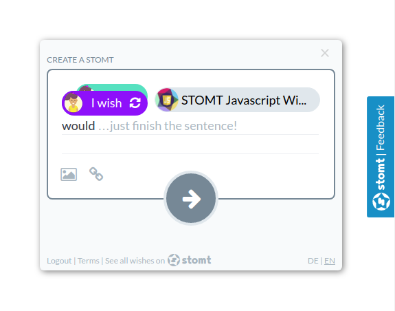
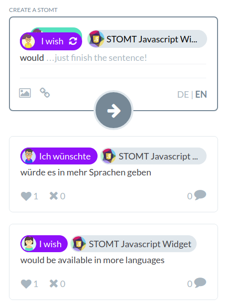
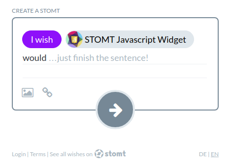

# STOMT JavaScript-SDK [](https://rest.stomt.com/)



* [Demo](#demo)
* [Installation](#installation)
  * [Tab](#documentation---tab)
  * [Feed](#documentation---feed)
  * [Create](#documentation---create)
  * [Events](#documentation---events)
* [Webview / Iframe](#webview--iframe)
* [Contribution](#contribution)

Our SDK allows you to add the feedback solution [www.stomt.com](https://www.stomt.com/) to your websites or any other HTML/JavaScript based applications. The SDK currently allows you to add a button to your website, which when used open a STOMT creation form. In the form customers can choose if they want to speak a wish or praise your site and then enter their thoughts. All submitted ideas can then be manages on the STOMT website, where they can be discussed, voted and finally come true. 

To connect your site to STOMT, [create a project page on stomt](https://www.stomt.com/createTarget) first.

## Demo

View the live demo [here](https://stomt.github.io/stomt-javascript-sdk/). The projects [source](https://github.com/stomt/stomt-javascript-sdk/tree/master/docs) can be found on GitHub, it itegrates the sdk dynamically in the [index.html](https://github.com/stomt/stomt-javascript-sdk/blob/master/docs/index.html#L99) file.


## Installation

To install the STOMT JavaScript-SDK you only have to add the following lines to the bottom of you html file and adjust the "targetId" at the bottom of the script to your business profiles username. 

```html
<div id="stomt_feed"></div> <!-- if you want to include a feed -->
<div id="stomt_create"></div> <!-- if you want to include a feed -->
<script>
  // Include the STOMT JavaScript SDK
  (function(w, d, n, r, t, s){
    w.Stomt = w.Stomt||[];
    t = d.createElement(n);
    s = d.getElementsByTagName(n)[0];
    t.async=1;
    t.src=r;
    s.parentNode.insertBefore(t,s);
  })(window, document, 'script', 'https://www.stomt.com/widget.js');
  
  // ADJUST THE 'PAGENAME' to your businesses username 
  // -> https://www.stomt.com/my-business -> my-business
  Stomt.push(['addTab', {targetId: 'PAGENAME'}]);
  Stomt.push(['addFeed', {targetId: 'PAGENAME'}]);
  Stomt.push(['addCreate', {targetId: 'PAGENAME'}]);
</script>
```
Copy & paste, done! You have further options to customize the widget. See the documentation part below.

## Documentation - Tab


### addTab
The current version allows you to add a Feedback button to your page:
```JavaScript
Stomt.push(['addTab', options]);
```

### showTab

You can use the `showTab(options)` method to show the widget if it is hidden.
```JavaScript
Stomt.push(['showTab', options]);
```

### hideTab

You can use the `hideTab()` method to hide the widget.
```JavaScript
Stomt.push(['hideTag']);
```

### toggleTab

You can use the `toggleTab(options)` method to toggle the widget.
```JavaScript
Stomt.push(['toggleTab']);
```

### updateTabFile

You can use the `updateTabFile()` method to set a new file for the Tab Widget. The next times a STOMT is created this file is attached.
```JavaScript
Stomt.updateTabFile(file);
```

### options
The `options` param has to be handed into the `addTab` function to initialize the widget and can be handed into the `showTab` function to update the widget state.

| Property | Type | Description |
| :--- | :--- | :--- |
| `targetId` _(required)_ | String | The `targetId` is your pages identifier you can copy it from the pages url (https://www.stomt.com/stomt-javascript-sdk -> stomt-javascript-sdk). All stomts created using the JavaScript-SDK will be addressed to this page. |
| `position` | String | You can set the `position` of the button, the default position is `right`. If required you can align the button to the left side by passing `position: 'left'`. |
| `label` | String | The default label of the button is `Feedback`, you can change that by passing another `label`. |
| `colorText` | String | To change the colors used for the widget button you have three options to configure. The first one is `colorText`, it allows you to change the text color (default: `#FFFFFF`). |
| `colorBackground` | String | The `colorBackground` option allows you to change the background color of the button (default: `#0091C9`). |
| `colorHover` | String | The `colorHover` option allows you to change the background color of the button when the user hovers it (default: `#04729E`). |
| `file` | Object | By attaching a JSON object with the properties `name` (String) and `data` (Object) to the property `file`, data can be attached to STOMTs that are submitted from the Tab Widget. |
| `showClose` | Boolean | Via the `showClose` property, you can specify whether the Close Icon in the Tab Widget should be shown or not (default: `true`). |
| `preload` | Boolean | By setting the property `preload` to `true`, you can tell the Widget to preload the Tab iframe in the background (default: `false`). This reduces the loading delay when showing the Tab for the first time. |

Example:
```JavaScript
var options = {
  targetId: 'stomt-javascript-sdk', 
  position: 'left', 
  label: 'Speak your wish!', 
  colorText: '#FFFFFF', 
  file: {name: 'fileName.file', data: Object}, 
  showClose: false
};

Stomt.push(['addTab', options]);
```

### Custom CSS

The feedback button can be styled and positioned using the css class `.stomt-button`.

For example: 

```css
/* round button in the bottom right corner */
.stomt-button {
  height: auto;
  border-radius: 50%;
  right: 50px;
  bottom: 50px;
  color: transparent;

  transform: none;
  float: none;
  padding: 0;
}

/* overwrite the content with a custom icon */
.stomt-button:before {
  font-family: "my-icon-font";
  line-height: 1;
  display: inline-block;
  content: "my-custom-icon";
  color: #ffffff;
  font-size: 40px;
  padding: 5px;
}
```

To add custom styling to the widget itself please add a `<style>` tag to the page containing the STOMT widget. This tag will be put inside the iframe to overwrite the default styling.

To allow us to read the tag please add the attribute `stomt-widget` to the `<style>` tag: `<style stomt-widget>`. To be sure that your styles overwrite the default styling please use `!important`.

An example for custom styles can be found below:

```html
<style stomt-widget>
  /* customize wish/like bubble color */
  /* NOTE: please adjust the font color when changing the background-color */
  .stomt-create-bubble--wish {
    background-color: blue !important;
    border-color: blue !important;
    color: white !important;
  }
  .stomt-create-bubble--like {
    background-color: green !important;
    border-color: green !important;
    color: white !important;
  }

  /* customize target bubble */
  /* NOTE: please adjust the font color when changing the background-color */
  .stomt-create-target-bubble {
    background-color: darkgray !important;
    border-color: darkgray !important;
    color: white !important;
  }

  /* customize widget background color*/
  /* NOTE: when changing the background color you might have to adjust header and footer colors*/
  .stomtApp body {
    background: white !important;
  }

  /* customize header color */
  .feed-headline-small {
    color: black !important;
  }

  .widget-footer {
    background: white !important;
  }

  /* customize footer color */
  .widget-footer a {
    color: black !important;
  }

  /* customize submit button color */
  /* NOTE: please adjust the font color when changing the background-color */
  .stomt-form-submit {
    background-color: green !important;
    color: white !important;
  }
  .stomt-form-submit--disabled {
    background-color: darkgray !important;
  }
</style>
```


## Documentation - Feed


### addFeed
The current version allows you to add a STOMT feed somewhere on your page:
```JavaScript
Stomt.push(['addFeed', options]);
```

### options
The `options` param has to be handed into the `addFeed` function to initialize the widget.

| Property | Type | Description |
| :--- | :--- | :--- |
| `targetId` _(required)_ | String | The `options` object has to contain a `targetId`. The `targetId` is your pages identifier you can copy it from the pages url (https://www.stomt.com/stomt-javascript-sdk -> stomt-javascript-sdk). The Feed will show stomts addressed to this page. |
| `elementId` | String | You can define where you want to show the feed on your page. Simply add an empty element with an id: `<div id="stomt_feed"></div>`,  `stomt_feed` is the default id, if you want to use another id you can use this option and pass your custom elementId. |
| `callDE` | String | The custom german call-to-action that will be displayed at the top of your feed. |
| `callEN` | String | The custom english call-to-action that will be displayed at the top of your feed. |
| `lang` | String | Force the default language of the user interface and the stomt creation form. At the moment, `en` and `de` are available. (default: `en`) |
| `creation` | Boolean | Hide the creation form by setting `creation` to `false`. (default: true) |
| `q` | String | Filter the feed for a specific keyword. |
| `has` | String | Filter the feed for specific stomts, e.g. <br> - `reaction` - with a reaction <br> - `!reaction` - without a reaction |
| `label` | String | Only show stomts with a specific label attached. |
| `from` | String | Only show stomts created by a specific user. |
| `is` | String | Filter what kind of stomts you want to show, e.g. `wish`,`like`. |
| `resize` | Boolean | Resize the iframe height automatically when the content changes. Set this option to `false` to disable resizing. |
| `limit` | Integer | Choose how may stomts should be displayed maximal. Only works when `resize` is set to `true`. (default: no limit) |
| `initial` | Integer | Choose how may stomts should be requested.  Only works when `resize` is set to `true`. (default: `15`) |

Example:
```JavaScript
var options = {
  targetId: 'stomt-javascript-sdk', 
  elementId: 'custom-element', 
  callDE: 'Sags mir', 
  callEN: 'Tell me', 
  lang: 'de', 
  creation: false,
  q: 'improve',
  has: 'reaction',
  label: 'discuss',
  from: 'userID',
  resize: false,
  initial: 20,
};

Stomt.push(['addFeed', options]);
```

### Custom CSS

The stomt feed can be styled and positioned using the css class `.stomt-feed-iframe`.

For example: 

```css
.stomt-feed-iframe {
  /* use max-width instead of width to ensure that the feed is visible on mobile devices */
  max-width: 600px;
  /* use min-height to define how many stomts should be visible without scrolling (850px ~ 3 stomts)*/
  min-height: 850px;
}
```

To change the content inside the iframe use the same method as described above in [addTab - Custom CSS](#custom-css).


## Documentation - Create


### addCreate

The current version allows you to add a STOMT creation form somewhere on your page, it searched for an element with the id `stomt_create` and adds the creation form in this element:
```JavaScript
Stomt.push(['addCreate', options]);
```

### showCreate

You can use the `showCreate(options)` method to show the widget if it is hidden or if it has been added with the `preload` flag.
```JavaScript
Stomt.push(['showCreate', options]);
```

### hideCreate

You can use the `hideCreate()` method to hide the widget.
```JavaScript
Stomt.push(['hideCreate']);
```

### updateCreateFile

You can use the `updateCreateFile()` method to set a new file for the Create Widget. The next times a STOMT is created this file is attached.
```JavaScript
Stomt.push(['updateCreateFile', file]);
```

### options
The `options` param has to be handed into the `addCreate` function to initialize the widget and can be handed into the `showCreate` function to update the widget state.

| Property | Type | Description |
| :--- | :--- | :--- |
| `targetId` _(required)_ | String | The `options` object has to contain a `targetId`. The `targetId` is your pages identifier you can copy it from the pages url (https://www.stomt.com/stomt-javascript-sdk -> stomt-javascript-sdk). All stomts created using the JavaScript-SDK will be addressed to this page. |
| `elementId` | String | You can define where you want to show the feed on your page. Simply add an empty element with an id: `<div id="stomt_create"></div>`,  `stomt_create` is the default id, if you want to use another id you can use this option and pass your custom elementId. |
| `lang` | String | Force the default language of the user interface and the stomt creation form. At the moment, `en` and `de` are available. (default: `en`) |
| `file` | Object | By attaching a JSON object with the properties `name` (String) and `data` (Object) to the property `file`, data can be attached to STOMTs that are submitted from the Create Widget. |
| `preload` | Boolean | By setting the property `preload` to `true`, you can tell the Widget to preload the Create iframe in the background (default: `false`). This reduces the loading delay when showing the Widget for the first time. <br>Important: When using the `preload` flag, the iframe will not be shown initially. You have to explicitly show it via `Stomt.showCreate`. |

Example:
```JavaScript
var options = {
  targetId: 'stomt-javascript-sdk', 
  elementId: 'custom-element', 
  lang: 'de', 
  file: {name: 'fileName.file', data: Object}, 
  preload: true
};

Stomt.push(['addCreate', options]);
```

### Custom CSS

To change the content inside the iframe use the same method as described above in [addTab - Custom CSS](#custom-css).

## Documentation - events

You can register Event Listeners to react on user interactions with the widget by calling `registerWidgetListener`. Registered Callbacks can be removed via the `removeWidgetListener` method.
```JavaScript
function callback (data) {
  ...
}

// to add the callback
Stomt.push(['registerWidgetListener', 'eventType', callback]);

// to remove the callback
Stomt.push(['removeWidgetListener', 'eventType', callback]);
```

Available events are:

| eventType | Description |
| :--- | :--- |   
| `stomtFeed-resize` | listen to resize events of the Feed Widget iframe. Only works when the `resize` flag is set to true. |
| `stomtTab-hide` / `stomtTab-show` | is fired when the visibility of the Tab Widget changes. |
| `stomtCreate-hide` / `stomtCreate-show` | is fired when the visibility of the Create Widget changes. |
| `widgetType-stomtCreated` | is fired when a user submitted a STOMT. The event data handed to the callback contains the created STOMT and the SDK the event originated from. |
| `widgetType-subscribed` | is fired when a user subscribed your target via the Widget. The event data handed to the callback contains the email or phone number used to subscribe and the SDK the event originated from. |

(replace `widgetType` with `stomtFeed`, `stomtTab` or `stomtCreate`)

## WebView / Iframe

Instead of using the Javascript snippet you can access the feed page directly in a WebView or Iframe. (For many platforms we did this step for you already and you can grab one of our [SDKs](http://stomt.web/dev).


To embed the form use this url: [https://www.stomt.com/widget](https://www.stomt.com/widget)

To embed the feed use this url: [https://www.stomt.com/feedwidget](https://www.stomt.com/feedwidget)

You can attach all the parameters introduced before (`options.targetId`, ...) to customize the feed for your project:

e.g. `https://www.stomt.com/widget?targetId=stomt&callEN=Tell+us+what+you+miss`


## Contribution

We would love to see you contributing with your ideas to the STOMT JavaScript-SDK. Please addess all your wishes to the [STOMT SDK (JS) on STOMT](https://www.stomt.com/stomt-javascript-sdk). 

## Authors

* [Max Klenk](https://github.com/maxklenk)
* [Mathias Möller](https://github.com/mathiasmoeller)

## More about STOMT

* On the web [www.stomt.com](https://www.stomt.com)
* [STOMT for iOS](http://stomt.co/ios)
* [STOMT for Android](http://stomt.co/android)
* [STOMT for Unreal Engine](http://stomt.co/unreal)
* [STOMT for Unity 3D Engine](http://stomt.co/unity)
