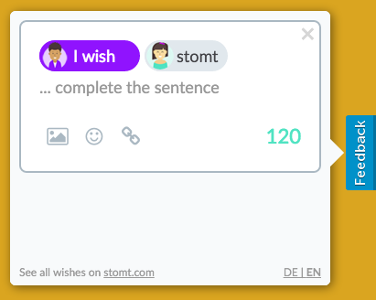
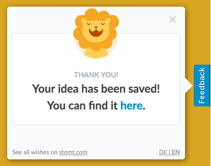

# stomt JavaScript-SDK [](https://rest.stomt.com/)

<a href="http://maxklenk.github.io/angular-sample-app/" title="sample application">

</a>

Our SDK allows you to add the feedback solution [www.stomt.com](https://www.stomt.com/) to your websites or any other HTML/JavaScript based applications. The SDK currently allows you to add a button to your website, which when used open a stomt creation form. In the form customers can choose if they want to speak a wish or praise your site and then enter their thoughts. All submitted ideas can then be manages on the stomt website, where they can be discussed, voted and finally come true. 

To connect your site to stomt, [create a project page on stomt](https://www.stomt.com/createTarget) first.

## Demo

View the live demo [here](http://maxklenk.github.io/angular-sample-app/). The projects [source](https://github.com/maxklenk/angular-sample-app) can be found on GitHub, it itegrates the sdk dynamically in the [index.html](https://github.com/maxklenk/angular-sample-app/blob/master/app/index.html#L58) file.


## Installation

To install the stomt JavaScript-SDK you only have to add the following lines to the bottom of you html file and adjust the "targetId" at the bottom of the script to your business profiles username. 

```html
<script>
  // Include the Stomt JavaScript SDK
  (function(w, d, n, r, t, s){
    w.Stomt = w.Stomt||[];
    t = d.createElement(n);
    s = d.getElementsByTagName(n)[0];
    t.async=1;
    t.src=r;
    s.parentNode.insertBefore(t,s);
  })(window, document, 'script', '//www.stomt.com/widget.js');
  
  // ADJUST THE 'PAGENAME' to your businesses username 
  // -> https://www.stomt.com/my-business -> my-business
  Stomt.push(['addTab', {targetId: 'PAGENAME'}]);
</script>
```
Copy & paste, done! You have further options to customize the widget. See the documentation part below.

## Documentation

The current version allows you to add a Feedback button to your page:
```JavaScript
Stomt.push(['addTab', options]);
```

### options.targetId

The `options` object has to contain a `targetId`. The `targetId` is your pages identifier you can copy it from the pages url (https://www.stomt.com/stomt-javascript-sdk -> stomt-javascript-sdk). All stomts created using the JavaScript-SDK will be addessed to this page:
```JavaScript
Stomt.push(['addTab', {targetId: 'stomt-javascript-sdk'}]);
```

### options.position

Optionally you can set the `position` of the button, the default possition is `right`. If required you can align the button to the left side by passing `position: 'left'`:
```JavaScript
Stomt.push(['addTab', {targetId: 'stomt-javascript-sdk', position: 'left'}]);
```


<a href="http://maxklenk.github.io/angular-sample-app/" title="sample application">

</a>


### options.label

The default label of the button is `Feedback`, you can change that by passing another `label`:
```JavaScript
Stomt.push(['addTab', {targetId: 'stomt-javascript-sdk', label: 'Speak your wish!'}]);
```

### options.colorText

To change the colors used for the widget button you have three options to configure.
The first one is `colorText`, it allows you to change the text color (default: `#FFFFFF`):
```JavaScript
Stomt.push(['addTab', {targetId: 'stomt-javascript-sdk', color: '#FFFFFF'}]);
```

### options.colorBackground

The `colorBackground` option allows you to change the background color of the button (default: `#0091C9`):
```JavaScript
Stomt.push(['addTab', {targetId: 'stomt-javascript-sdk', colorBackground: '#0091C9'}]);
```


### options.colorHover

The `colorHover` option allows you to change the background color of the button when the user hovers it (default: `#04729E`):
```JavaScript
Stomt.push(['addTab', {targetId: 'stomt-javascript-sdk', colorHover: '#04729E'}]);
```


### Custom CSS

The feedback button can be styled and positioned using the css class `.stomt-button`.

For example: 

```css
/* round button in the bottom right corner */
.stomt-button {
  height: auto;
  border-radius: 50%;
  right: 50px;
  bottom: 50px;
  color: transparent;

  transform: none;
  float: none;
  padding: 0;
}

/* overwrite the content with a custom icon */
.stomt-button:before {
  font-family: "my-icon-font";
  line-height: 1;
  display: inline-block;
  content: "my-custom-icon";
  color: #ffffff;
  font-size: 40px;
  padding: 5px;
}
```

## Contribution

We would love to see you contributing with your ideas to the stomt JavaScript-SDK. Please addess all your wishes to the [stomt SDK (JS) on stomt](https://www.stomt.com/stomt-javascript-sdk). 

## Authors

* [Max Klenk](https://github.com/maxklenk)

## More about stomt

* On the web [www.stomt.com](https://www.stomt.com)
* [stomt for iOS](http://stomt.co/ios)
* [stomt for Android](http://stomt.co/android)
